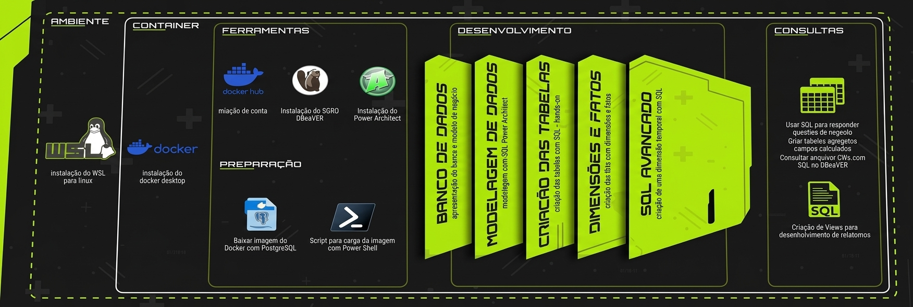

# Projeto sql_pentarruda

Time envolvido:
[Renato Albuquerque](https://www.linkedin.com/in/renato-malbuquerque/)
[Kleber Freitas](https://www.linkedin.com/in/kleber-freitas-2795227b/)
[Arruda Consulting](https://www.linkedin.com/company/arrudaconsulting/)

## 1. Arquitetura do Projeto


## 2. Configuração inicial do projeto
Passo a passo para criar o projeto com [uv](https://docs.astral.sh/uv/) e vinculá-lo a um repositório no GitHub.

### 2.1. Criar a pasta do projeto
No Windows, crie a pasta que abrigará o projeto (ex.: `sql_pentarruda`).

### 2.2. Inicializar o projeto com uv
Abra o terminal dentro da pasta do projeto e execute:
```bash
uv init
```

Isso cria a estrutura básica (`pyproject.toml`, `main.py`, `README.md`, `.python-version`) e inicializa um repositório Git local.

### 2.3. Criar o repositório no GitHub
No GitHub, crie um novo repositório **vazio** (sem README, `.gitignore` ou licença), para evitar conflitos no primeiro push.

### 2.4. Vincular a pasta local ao GitHub
No terminal, na pasta do projeto, seguir os passos do GitHub:
```bash
git add .
git commit -m "first commit"
git branch -M main
git remote add origin https://github.com/renato-albuquerque/sql_pentarruda.git
git push -u origin main
```

### 2.5. Verificação
Atualize a página do repositório no GitHub: os arquivos do projeto devem aparecer lá. Para conferir pelo terminal:
```bash
git remote -v
```

O resultado deve mostrar a URL do repositório para `fetch` e `push`.

## 2.6 Fluxo de trabalho no dia a dia
```bash
git add .
git commit -m "descrição da alteração"
git push
```

## 2.7. Observações
- `uv add <pacote>` adiciona dependências Python ao projeto (ex.: `uv add pandas`). Não tem relação com o GitHub.

